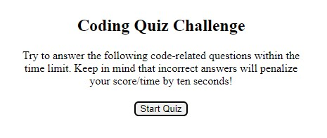
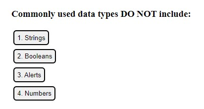

# Challenge 4 - Create a Code Quiz

## Description

The pupose of this challenge was to integrate several different concepts we have been learning about over the last week. The idea was to create a quiz that shows questions, deducts time for incorrect answers, and tracks the scores of users.

## Installation

N/A

## Usage

>To begin the quiz, simply click the **Start Quiz** button.

 >Answer the questions by clicking the corresponding **answer** button.

## License

Please refer to the license in the repo.